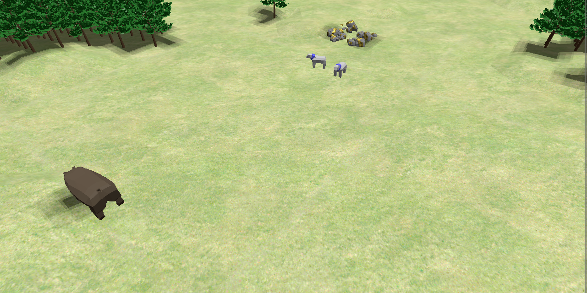

# webaoe

A Typescript library which uses three.js to render 3 dimensional Age of Empires 2 maps in the browser.

This repository is a proof of concept. Many improvements could enable viewing live games. However, there is no api for accessing game state without simulating on the current game version. The current state-of-the-art live game viewer, [CaptureAge](https://captureage.com/) runs along side the game to access in-game state from memory. Nevertheless, this tool could serve as an accessible map analysis tool.

[demo](https://jdekarske.github.io/webaoe/)

